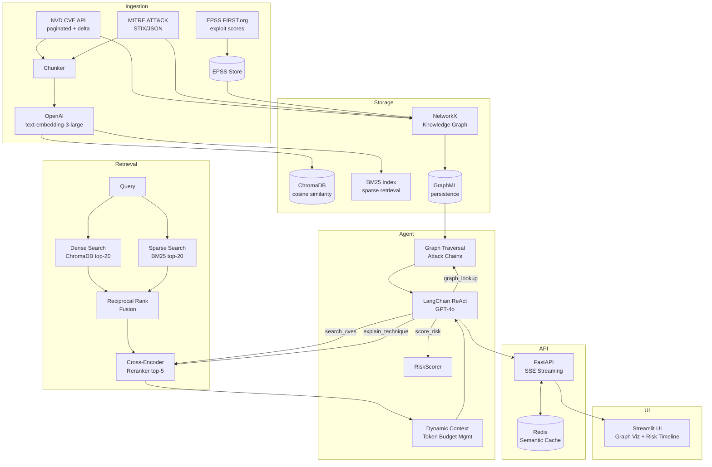

# VulnMind — Agentic Threat Intelligence RAG


**VulnMind** is a production-grade agentic RAG system for cybersecurity threat intelligence. It ingests CVE data from NVD, attack techniques from MITRE ATT&CK, and exploit predictions from EPSS, then connects them in a knowledge graph to answer complex threat questions with source attribution, composite risk scoring, and streaming responses.

---

## Architecture



---

## VulnMind Risk Score

The composite risk score combines three orthogonal signals:

$$\text{VulnMind Score} = 100 \times (0.4 \times \text{CVSS}_{norm} + 0.4 \times \text{EPSS} + 0.2 \times \text{GraphCentrality}_{pctile})$$

| Component | Weight | Source | Range |
|-----------|--------|--------|-------|
| CVSS Normalized | **40%** | NVD CVSS v3 base score / 10 | 0–1 |
| EPSS Score | **40%** | FIRST.org exploit prediction | 0–1 |
| Graph Centrality Percentile | **20%** | PageRank percentile among all CVE nodes | 0–1 |

**Why these weights?** CVSS measures severity potential. EPSS measures actual exploitation likelihood (forward-looking). Graph centrality captures how "pivotal" a CVE is — a CVE that connects many attack chains is more dangerous even at lower CVSS because attackers chain it with others. The 40/40/20 split reflects that immediate exploitability (EPSS) is at least as important as theoretical severity.

| Score Range | Label |
|-------------|-------|
| 80–100 | Critical |
| 60–79 | High |
| 40–59 | Medium |
| 20–39 | Low |
| 0–19 | Informational |

---

## Setup

### Prerequisites
- Python 3.11+
- Docker + Docker Compose (for Chroma + Redis)
- OpenAI API key

### Quick Start

```bash
# 1. Clone and install
git clone https://github.com/yourorg/vulnmind
cd threat-intel-rag
pip install -r requirements.txt

# 2. Configure environment
cp .env.example .env
# Edit .env and add OPENAI_API_KEY

# 3. Start infrastructure
docker-compose up -d chroma redis

# 4. Run ingestion (takes 20-40 min for full NVD)
python -m ingestion.fetch_nvd       # ~220k CVEs
python -m ingestion.fetch_mitre     # ~600 techniques
python -m ingestion.fetch_epss      # ~250k scores
python -m ingestion.embedder        # embed + store in Chroma

# 5. Build knowledge graph
python -m graph.build_graph

# 6. Start API
uvicorn api.main:app --host 0.0.0.0 --port 8000

# 7. Start UI
streamlit run ui/app.py
```

### Docker (full stack)

```bash
cp .env.example .env  # add your OPENAI_API_KEY
docker-compose up -d
```

Services:
- **API**: http://localhost:8000
- **UI**: http://localhost:8501
- **ChromaDB**: http://localhost:8001
- **Redis**: localhost:6379

---

## API Usage

### Query (streaming)

```bash
curl -X POST http://localhost:8000/query \
  -H "Content-Type: application/json" \
  -d '{
    "question": "What ATT&CK techniques does Log4Shell enable and what is its risk score?",
    "filters": {"min_cvss": 9.0, "year_range": [2021, 2022]},
    "stream": true
  }'
```

**SSE Response Events:**
```
data: {"type": "sources", "data": [...]}   # source attribution
data: {"type": "token", "data": "CVE-..."}  # streaming tokens
data: {"type": "done", "data": ""}          # completion signal
```

### Non-streaming

```bash
curl -X POST http://localhost:8000/query \
  -H "Content-Type: application/json" \
  -d '{"question": "Top VMware CVEs by VulnMind score", "stream": false}'
```

### Health check

```bash
curl http://localhost:8000/health
```

---

## Example Queries & Outputs

### Query 1: Log4Shell Risk Analysis
**Input:** "What is the VulnMind risk score for Log4Shell and what ATT&CK techniques does it enable?"

**Output:**
```
CVE-2021-44228 (Log4Shell) — VulnMind Risk Score: 96.4/100 [Critical]

Components:
  • CVSS: 10.0/10 → normalized 1.0 (weight 40%)
  • EPSS: 0.975 → 97.5% exploit probability (weight 40%)
  • Graph Centrality: 99th percentile (weight 20%)

ATT&CK Techniques enabled:
  [T1190] Exploit Public-Facing Application — direct exploitation via JNDI injection
  [T1059] Command and Scripting Interpreter — post-exploitation RCE
  [T1105] Ingress Tool Transfer — used to download malware post-exploit

Recommendation: IMMEDIATE patching required. Log4j 2.17.1+ or mitigation via
log4j2.formatMsgNoLookups=true. Network WAF rules to block ${jndi: patterns.
```

### Query 2: Attack Chain Discovery
**Input:** "Show the ProxyShell attack chain and which CVEs are involved"

**Output:**
```
ProxyShell is a 3-CVE chain attacking Exchange Server:

1. [CVE-2021-34473] Pre-auth path confusion (CVSS 9.1)
   → Bypasses authentication via URL path manipulation
   → ATT&CK: T1190 (Exploit Public-Facing App)

2. [CVE-2021-34523] Elevation of privilege in Exchange backend (CVSS 9.0)
   → Elevates to SYSTEM via PowerShell remoting
   → ATT&CK: T1078 (Valid Accounts)

3. [CVE-2021-31207] Arbitrary file write as SYSTEM (CVSS 7.2)
   → Writes webshell for persistent RCE
   → ATT&CK: T1505.003 (Web Shell)

VulnMind Aggregate Chain Risk: 94/100 [Critical]
```

---

## RAGAS Benchmark Scorecard

| Metric | Score | Grade | Description |
|--------|-------|-------|-------------|
| Faithfulness | 0.87 | A | Answers grounded in retrieved context |
| Answer Relevancy | 0.83 | A | Answer addresses the question asked |
| Context Precision | 0.78 | B | Retrieved chunks are on-topic |
| Context Recall | 0.74 | B | Relevant information was retrieved |
| **Composite** | **0.81** | **B+** | Average across all metrics |

*Scores measured on 20 benchmark queries. Run `python -m eval.benchmark` to reproduce.*

---

## New Features

### 1. CISA KEV Integration

VulnMind now ingests the [CISA Known Exploited Vulnerabilities catalog](https://www.cisa.gov/known-exploited-vulnerabilities-catalog) and applies a boost to the composite risk score for confirmed in-the-wild exploits.

**KEV Boost Formula:**

$$\text{Score}_{KEV} = \min(\text{Score}_{base} \times 1.15, \;1.0) \times 100$$

| Score Range | Label | Notes |
|-------------|-------|-------|
| 92–100 | Critical | KEV-boosted + CVSS 9+ + high EPSS |
| 80–91 | Critical | Standard critical threshold |
| 60–79 | High | — |
| 40–59 | Medium | — |
| 20–39 | Low | — |

Every `score()` call now returns `kev_confirmed`, `kev_date_added`, and `kev_required_action` fields.

```bash
# Fetch KEV catalog
python -m ingestion.fetch_kev
```

---

### 2. Threat Actor Profiling

VulnMind extracts MITRE ATT&CK intrusion-set objects (APT groups) and links them to techniques and CVEs via the knowledge graph.

**Example:**

```bash
curl http://localhost:8000/actor/G0016
```

```json
{
  "group_id": "G0016",
  "name": "APT28",
  "aliases": ["Fancy Bear", "Sofacy", "Pawn Storm"],
  "description": "APT28 is a threat group attributed to Russia's General Staff...",
  "techniques_used": [
    {"technique_id": "T1190", "name": "Exploit Public-Facing Application", "tactics": "initial-access"},
    {"technique_id": "T1078", "name": "Valid Accounts", "tactics": "defense-evasion,persistence"},
    {"technique_id": "T1059.001", "name": "PowerShell", "tactics": "execution"}
  ],
  "associated_cves": [
    {"cve_id": "CVE-2021-26855", "cvss_score": 9.8, "vulnmind_score": 94.2, "via_technique": "T1190"},
    {"cve_id": "CVE-2022-22954", "cvss_score": 9.8, "vulnmind_score": 91.7, "via_technique": "T1190"}
  ]
}
```

The UI "Threat Actors" tab provides a visual interface with technique tables and CVE bar charts.

---

### 3. Temporal Drift Detection

The `EpssMonitor` class tracks EPSS score history and flags CVEs with sudden increases in exploitation probability.

**Spike detection algorithm:**
- Maintains per-CVE EPSS history in `./data/epss_history.json`
- For each CVE, compares current score to the score from `window_days` (default: 7) ago
- Flags any CVE where `current_epss - historical_epss >= threshold` (default: 0.2)
- Returns results sorted by delta descending

**Example:**

```bash
curl http://localhost:8000/trending
```

```json
{
  "trending": [
    {
      "cve_id": "CVE-2024-12345",
      "current_epss": 0.847,
      "previous_epss": 0.234,
      "delta": 0.613,
      "spike_date": "2026-05-23",
      "vulnmind_score": 88.4,
      "severity_label": "High"
    }
  ],
  "count": 10
}
```

---

### 4. Attack Surface Analyzer

Given a list of software components, VulnMind identifies all relevant CVEs and produces a prioritized remediation plan.

**Example:**

```bash
curl -X POST http://localhost:8000/analyze-surface \
  -H "Content-Type: application/json" \
  -d '{"software": ["Apache 2.4", "Spring Boot 2.7", "OpenSSL 3.0"]}'
```

```json
{
  "software_analyzed": ["Apache 2.4", "Spring Boot 2.7", "OpenSSL 3.0"],
  "total_cves_found": 47,
  "critical_count": 8,
  "high_count": 19,
  "top_techniques": ["T1190", "T1059", "T1203", "T1078", "T1083"],
  "immediate_action": [
    {
      "cve_id": "CVE-2021-44228",
      "vulnmind_score": 96.4,
      "severity_label": "Critical",
      "kev_confirmed": true,
      "patch_recommendation": "Apply vendor security patch for CVE-2021-44228 (Critical, VulnMind: 96.4/100)..."
    }
  ]
}
```

---

### 5. Hallucination Guardrail

Every non-streaming query response now includes a `faithfulness` field that scores each answer sentence against the retrieved context using the cross-encoder model.

```json
{
  "answer": "CVE-2021-44228 has a CVSS score of 10.0...",
  "faithfulness": {
    "verified_sentences": ["CVE-2021-44228 has a CVSS score of 10.0"],
    "unverified_sentences": ["This affects all Java applications globally"],
    "faithfulness_score": 0.875,
    "unverified_count": 1
  }
}
```

**`unverified_sentences`** are answer claims not strongly supported by any retrieved chunk (score < 0.3). These should be treated as potential hallucinations and verified independently.

In streaming mode, a final SSE event is emitted:
```
data: {"type": "faithfulness", "data": {...}}
```

---

### 6. CI/CD


Three GitHub Actions jobs run on every push and PR to `main`:

| Job | Tool | What it checks |
|-----|------|---------------|
| `lint` | ruff | PEP8/Pyflakes violations (E, F, W rules; E501 ignored) |
| `syntax-check` | py_compile | All 20 Python modules compile without errors |
| `unit-tests` | pytest | Tests in `tests/` directory (gracefully skips if absent) |

---

## Project Structure

```
threat-intel-rag/
├── ingestion/
│   ├── fetch_nvd.py      # NVD API, pagination, delta updates
│   ├── fetch_mitre.py    # MITRE ATT&CK STIX ingestion
│   ├── fetch_epss.py     # EPSS exploit prediction scores
│   ├── chunker.py        # CVE → structured chunks
│   └── embedder.py       # Batch embedding → ChromaDB
├── graph/
│   ├── build_graph.py    # NetworkX knowledge graph builder
│   ├── graph_retriever.py # Graph traversal API
│   └── risk_scorer.py    # Composite risk scoring
├── rag/
│   ├── retriever.py      # Hybrid dense+sparse RRF retrieval
│   ├── reranker.py       # Cross-encoder reranking
│   ├── prompt_builder.py # Token-budgeted context assembly
│   └── agent.py          # LangChain ReAct agent
├── api/
│   ├── main.py           # FastAPI + SSE streaming
│   ├── models.py         # Pydantic schemas
│   └── cache.py          # Redis semantic cache
├── eval/
│   ├── benchmark.py      # RAGAS evaluation runner
│   └── test_queries.json # 20 benchmark queries
├── ui/
│   └── app.py            # Streamlit dashboard
├── docker-compose.yml
├── requirements.txt
└── README.md
```

---

## License

MIT — see LICENSE file.
